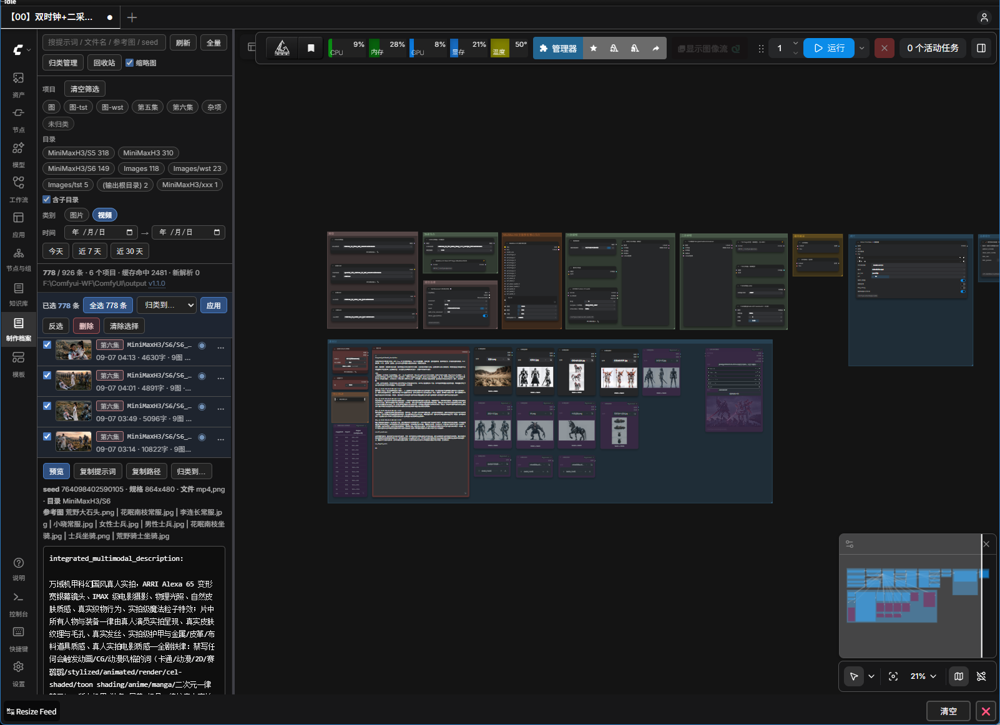
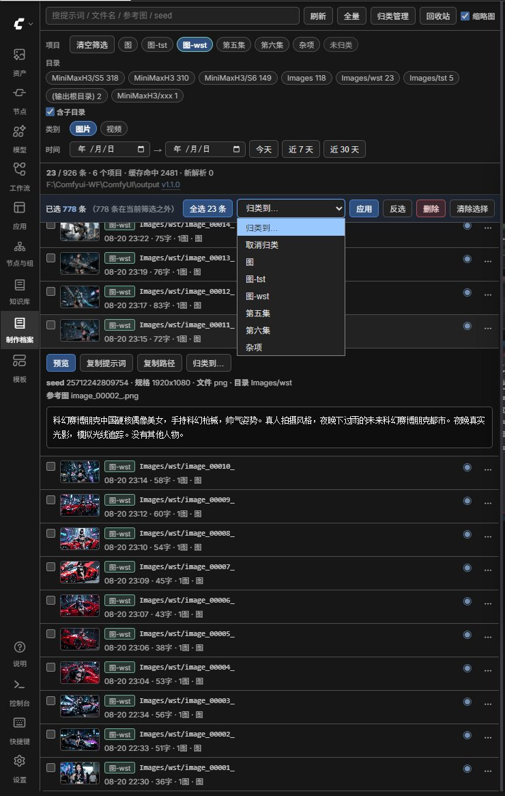
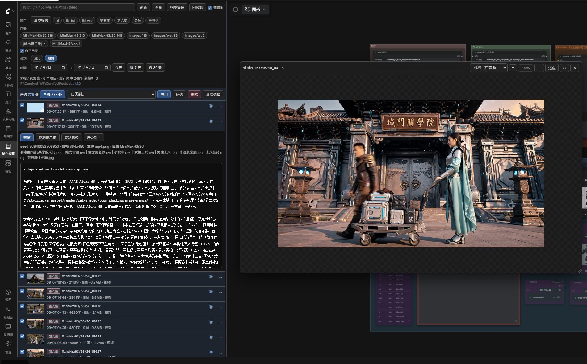
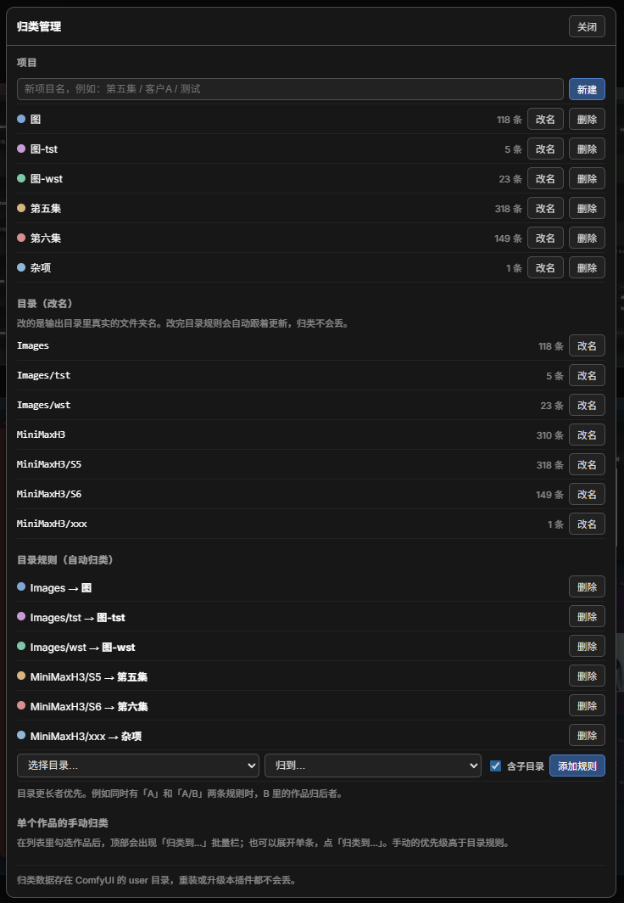

<p align="center">
  
</p>

# production-archive · 制作档案

把一个输出目录里**每一个 PNG / MP4 内嵌的元数据**汇总成一份可搜索的档案，
在 ComfyUI 左侧栏开一个「制作档案」面板：找回历史提示词、归类作品、直接预览成片。

适用于任何 ComfyUI 工作流，不限定模型或节点包。

> **作者 / 出处**：[@tonyhbcom](https://github.com/tonyhbcom) ·
> 官方仓库 <https://github.com/tonyhbcom/production-archive>
> （本插件为 MIT 许可，可自由使用与修改，但请保留 `LICENSE` 中的版权声明。
> 如果你在别处看到这个插件，以官方仓库为准 —— 那边的版本最新。）

---

## 先看界面

左侧栏多一个「制作档案」面板，点开就是你所有历史作品的档案：



搜索、项目 / 目录 / 类别 / 时间筛选、批量归类，全在这一个面板里完成：



点眼睛图标直接预览成片 —— 视频优先用带音轨的那一份：



项目与目录规则在这里管理（目录规则会对以后新出的作品持续生效）：



---

## 它解决什么问题

ComfyUI 自己的「历史记录」是**内存态**的——重启就清空，找不回上周那条提示词。

但输出文件本身是带元数据的：

| 文件 | 元数据位置 | 内容 |
|---|---|---|
| `.png` | `tEXt` 块 | `prompt`（API 执行图，含提示词全文）+ `workflow`（完整节点图） |
| `.mp4` | `moov > udta > meta > ilst` | 同上（由 `VHS_VideoCombine` 写入，`-audio.mp4` 也有） |

PNG 那一路是 ComfyUI 核心自带的，人人都有；MP4 那一路需要用到 VideoHelperSuite 的合并节点。

本插件把这些元数据扫出来、索引好，做成可搜索、可预览、可整理的列表。

**浏览、搜索、筛选、预览、归类 —— 全程只读，绝不动你的文件。**
只有你主动点了「改名 / 移动 / 删除」时才会写盘，而且：

- **删除是软删除** —— 文件被移进回收站，随时能恢复，**绝不真删**
- 改名 / 移动**永远整组一起**（`.png` + `.mp4` + `-audio.mp4`），不会把一条作品拆散
- 一律限制在输出目录之内，且**绝不覆盖任何已存在的文件**（重名自动加 `(2)`）

---

## 功能

### 1. 搜索与筛选

- **关键词**：提示词正文、文件名、参考图名、seed、项目名，全字段模糊匹配
- **项目**：多选。点项目标签即可叠加 / 取消
- **目录**：多选。标签上带该目录的作品数，默认按作品数降序，超过 14 个折叠
  - 勾选「含子目录」后，选中 `A` 会连带 `A/B` 一起命中；关掉则只匹配该目录本身
  - 输出根目录单列一个 `(输出根目录)` 标签，**只做精确匹配**，不会误伤子目录
- **类别**：图片 / 视频，可多选
- **时间**：起止日期，另有「今天 / 近 7 天 / 近 30 天」快捷键

以上条件**取交集**。例如：勾「项目A」+「视频」+ 某个目录 + 某一天 = 该项目在该目录当天出的所有视频。

### 2. 归类（自定义项目）

- **新建 / 改名 / 删除 / 改色**项目
- **目录规则（自动）**：把某个目录（可选含子目录）整个归到一个项目。之后这个目录里**新生成的作品会自动进来**，不用再管
- **手动归类（单条）**：展开任意一条 → 「归类到…」
- **手动归类（批量）**：勾选多条 → 顶部「归类到…」→ 应用
- **全选**：顶部工具条**常驻**一个「全选 N 条」按钮，N 随筛选结果实时变化。
  典型用法是先按项目 / 目录 / 类别筛出目标范围，再点「全选」整批归类
  - 已选中但不在当前筛选结果内的条目会提示「（M 条在当前筛选之外）」，避免误伤
- **优先级**：手动归类 > 目录规则（目录路径更长者优先）> 未归类

> 首次运行时，插件会按你现有的输出子目录名自动建立一套初始项目和规则
> （只取第一层目录，避免深目录炸出一堆项目）。
> 之后一切以界面上的操作为准，不会被自动覆盖，可以随意改名或删除。

### 3. 预览

每条记录右边的 ◉ 按钮（或展开后的「预览」）可直接看片：

- 图片和视频都支持，**视频优先用带音轨的 `-audio.mp4`**
- **拖动标题栏**移动窗口，**拖右下角**改大小
- **鼠标滚轮**在画面上缩放，也可用标题栏的 −／＋／适应
- **放大后按住画面就能拖**，上下左右随便拉，看细节不用反复缩放

> 预览画面会**主动拦住自己的鼠标点击**，不让它冒泡到页面。
> 这是为了跟 `comfyui-custom-scripts`（pysssss）那类图片灯箱共存 ——
> 它在 document 上监听图片点击，不拦的话你一拖完就会被换成它的全屏大图。
- 同一作品既有图又有视频时，标题栏出现切换下拉
- ⛶ 全屏，再点还原（会记回原来的窗口大小和位置）

> 预览走本地接口 `/productionarchive/file`，路径被限制在输出目录内，挡掉目录穿越。

### 4. 列表缩略图

每条作品左边一张小预览图 —— 图片直接显示，视频取首帧。**点它就能开大预览。**

缩略图是「滚到哪加载到哪」的：900 多条作品一起打开也不会卡。

不想要小图的话，顶栏有个「**缩略图**」开关，关掉列表更紧凑（选择会被记住）。

### 5. 整理（改名 / 移动 / 删除）

每条右边的 `⋯` 就是这三个动作：

- **改名**：改作品名，同一次生成的图 / 视频 / 音轨一起改
- **移动到…**：移到输出目录里的任何位置，也可以当场新建子目录
- **删除**：移进**回收站**，不是真删。删完顶部会弹一条提示告诉你去了哪、
  怎么恢复；回收站面板开着的话会自动刷新

顶部工具条还有个「**回收站**」：看清单、逐条**恢复**、或者彻底删除。
每条还会显示**提示词字数** —— 一眼看出提示词也跟着进了回收站，恢复就原样回来。
删掉的作品，它的手动归类和目录规则都给你记着，恢复之后自动接回原来的项目。

**⚠️ 这里的「回收站」不是 Windows 系统回收站。**

删除做的是**移动**（把文件搬到 `ComfyUI\user\production_archive\_trash\`），
不是系统级删除 —— 所以 **Windows 系统回收站里永远找不到它们**，别去那儿白找。

- 想看文件：面板里点「**打开文件夹**」，直接弹出来给你看
- 为什么不用系统回收站：① Mac / Linux 用户同样能用，② 恢复时**归类不会丢**
  （系统回收站只记原路径，记不住"这条属于第五集"）

批量也能删：勾选多条 → 顶部「删除」。

「归类管理」里还新增了**目录改名** —— 改的是输出目录里真实的文件夹名，
**目录规则会自动跟着更新**，归类不会丢。

> 为什么删除是软删除：输出目录里是你的作品，不是缓存。
> 工具是帮你省事的，不该成为一次误点就毁掉素材的东西。

### 6. 自动更新

每次出片完成后自动增量索引，无需手动刷新。
也可点「刷新」（增量，通常 1 秒内）或「全量」（重解析全部文件）。

面板底部会显示当前版本号，**点一下可以看到本版新增了什么**。

---

## 它扫的是哪个目录

**只扫一个根目录：ComfyUI 当前的输出目录**（面板状态行会实时显示它的绝对路径）。

- 默认是 `<ComfyUI>/output`
- 可以在启动时改：`--output-directory "D:\某处\output"`（覆盖 `--base-directory`）
- 插件**不写死路径**，每次都用 ComfyUI 运行时的 `folder_paths.get_output_directory()` 取值，
  所以你在启动参数里改了目录，插件下次请求就自动跟着走，不需要改任何配置

子目录（比如 `项目A/第一集`）不是插件建的，而是**节点里的 `filename_prefix` 带路径**造成的——
`SaveImage` 和 `VHS_VideoCombine` 都支持在文件名前缀里写子目录。
所以想按项目 / 按集分开摆放的，直接在节点上把前缀写成 `项目A/第一集/xxx` 就行，
插件会把它识别成一个独立目录供筛选和归类。

> 注意：改输出目录后，**旧目录里的历史作品不会出现在列表里**（只扫当前目录）。
> 归类数据不受影响（存在 user 目录）。

---

## 安装

**方式一：ComfyUI Manager**（发布到 Registry 后可用）

在 Manager 里搜索 `production-archive`，点安装，重启。

**方式二：手动**

把整个目录放进 `ComfyUI/custom_nodes/`，重启 ComfyUI。

不需要 `pip install` 任何东西。

---

## 用法

1. 重启 ComfyUI（或 Manager 里的 Restart）
2. 左侧栏点 **「制作档案」**（书本图标）
3. 首次打开会扫描一遍，之后都是秒开

---

## 性能

实测（2515 个输出文件 / 2500 余条记录，机械硬盘）：

| 场景 | 耗时 |
|---|---|
| 首次全量解析 | **约 5 秒** |
| 「刷新」增量（无新文件） | **0.2 秒** |
| 重复请求（30 秒内内存缓存） | **0.02 秒** |
| 归类改动后重新加载 | 约 0.2 秒 |

增量策略：按 `(mtime, size)` 比对，只有新增或改动的文件才重新解析。
索引缓存在 user 目录，gzip 压缩后约 0.7 MB。

面板在整个过程中**不占显存、不进执行图**，跑图时打开也不影响出图速度。

---

## 文件结构

```
production-archive/
├── __init__.py            # 路由注册（列表 / 项目 / 归类 / 文件流）+ 版本号
├── engine.py              # 扫描引擎：元数据解析 + 增量缓存 + 归并
├── store.py               # 归类存储：项目 / 目录规则 / 手动指派 + 旧数据迁移
├── pyproject.toml         # 发布信息
├── CHANGELOG.md           # 更新日志
└── web/js/production_archive.js   # 侧边栏面板 + 预览窗 + 归类管理
```

**归类数据与索引缓存都不在插件目录里**，而是存在 ComfyUI 的 user 目录：

```
<ComfyUI>/user/production_archive/projects.json       # 你的项目与归类
<ComfyUI>/user/production_archive/index-cache.json.gz # 索引缓存，删了会自动重建
```

这样删除 / 重装 / 升级插件，你的项目与归类都不会丢。

---

## 接口

如果你想在别处调用，或做二次开发：

| 方法 | 路径 | 说明 |
|---|---|---|
| GET | `/productionarchive/list` | 全部记录（默认走 30 秒内存缓存） |
| GET | `/productionarchive/list?refresh=1` | 跳过内存缓存，做增量扫描 |
| GET | `/productionarchive/list?full=1` | 忽略磁盘缓存，全量重解析 |
| GET | `/productionarchive/projects` | 项目 / 规则 / 指派数据 |
| POST | `/productionarchive/projects` | `{action: add\|rename\|del\|color\|rule_add\|rule_del\|save, ...}` |
| POST | `/productionarchive/assign` | `{keys:[...], project:"名字"}`；project 为空则取消归类 |
| GET | `/productionarchive/file?f=<相对路径>` | 媒体文件流（图片 / 视频），路径限制在输出目录内 |
| GET | `/productionarchive/reveal?f=<记录名>` | 返回该记录对应的原始文件绝对路径 |

---

## 依赖

**没有任何第三方依赖。**

- Python 侧只用标准库：`os / struct / json / gzip / threading / datetime / asyncio / functools / shutil / re`
- 前端只 import ComfyUI 自带的 `scripts/app.js` 与 `scripts/api.js`
- 不需要 `pip install` 任何东西，不需要 ffmpeg，不需要 PIL

---

## 不用插件的替代用法

**任意一张 PNG 或 MP4 直接拖进 ComfyUI 界面**，会自动还原当时那条完整工作流
（含提示词、seed、参考图名单）——这是最省事的办法，不需要本插件。

本插件的价值在于**全局检索与归类**：几百条记录里找「上次那个 9 张参考图的构图」是哪一次、
当时写的是什么，以及把成片按项目攒成体系。

---

## 卸载

删掉 `custom_nodes/production-archive/` 整个目录，重启 ComfyUI 即可。
输出文件不受任何影响。

如果连归类数据也不要了，再删掉 `<ComfyUI>/user/production_archive/` 这个目录。

---

## License

MIT
